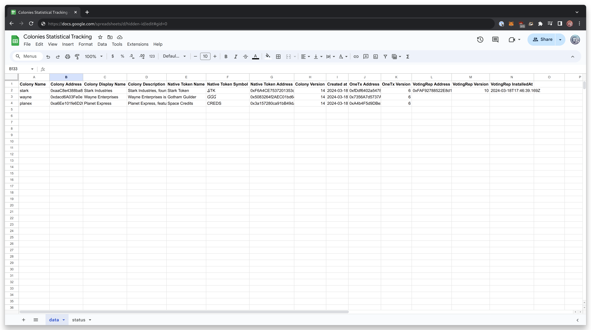

# Colonies Statistical Tracking

Fork of the block ingestor that tracks created colonies for marketing, statistical and research purpouses

This runs a cron job inside a docker container that pulls the colonies data from the database, matches with the ones we already know about, then store the new ones inside of the same Google Spreadsheet.

The second sheet inside that document stores the status of the latest document update.

